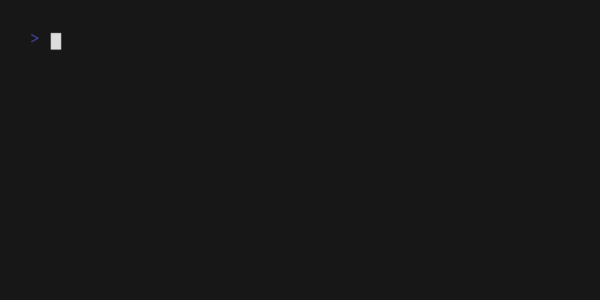

# stoac - Store a command
Stoac is a quick cli helper created for a very simple purpose: Keeping your shell commands organized. 

You can think of stoac as a vip history database with tagging abilites. 
It uses a Key-Value based database that will simply store any command you wish with a given tag. 
You can either store commands manually (as text) or store commands directly from you bash or zsh history using the index (similar to using e.g. "!12"). 
After you build your database you can simply execute your templates with the load flag and a given tag.  
The recommended way of using stoac is by utilizing the zsh integration provided. 
Intergration into other shells is currently on the bucket list. 

# Usage

Using stoacs zsh integration is straightforward. 
Just type the tag of your stored command into the shell and then activate the zsh plugin by hitting Ctrl+h. 
Stoac will then automatically fill your input with your stored command and you can edit and execute it. 
A simple example is visible in the following video. 

For more details on how to use stoac itself refer to [this section](#stoac-program-usage) or type stoac -h in your command line. 

# Installation

## zsh integration

The integration into the shell is what makes stoac really convenient and it is currently the recommended way to use this program. 

### Installer script

The most convient way to install everything (including the zsh integration) is by just executing the following one liner:

~~~bash
curl -sL https://github.com/Maxsak-dev/stoac/raw/main/zsh/install-zsh.sh | bash
~~~

This will setup everything for you by storing the zsh extension in your .config/stoac folder, sourcing it from within your .zshrc file and downloading and installing the latest binary release from Github.
As a prerequisit you should have zshell already installed and there should be a .zshrc file in your users home directory. 

### Manual install

It is also possible to setup stoac yourself any way you like it. 
For this you can install stoac by following the instructions from [the stoac installation instructions](#stoac-program-only). 
To add the zsh functionality you can either add the content of [this file](zsh/stoac.zsh) directly into your .zshrc file or download the file to any location you want and source the file from within your .zshrc file. 

## Stoac program only

To use stoac without the zsh integration (or if you want to manually install it) you can follow these instructions. 

### Binary Release

The simplest way to install stoac is by just downloading the latest release binary and then executing 

~~~bash
sudo install -m 755 stoac /usr/local/bin/stoac
~~~

to install it onto your system. 
You can install it everywhere you want, make sure that the path you install it to is added to your $PATH. 
Refer to the [install man pages](https://www.man7.org/linux/man-pages/man1/install.1.html) for more information on the command. 

### Manual Compilation

You can also compile the binary yourself by cloning the repository and using the provided makefile. 
The make install target will compile the release version of the rust program and then use the install command to install it. 
A running Rust installation is needed for this. 

# Stoac program Usage

Even though the recommended way of using stoac is currently only supported in combination with zsh, you can also use the stoac program without any shell integration. 
For this purpose an interactive command loading mode is also integrated into the program. 
The main drawback of this interactive mode is that path completion and other convenience methods of finishing commands are not supported in this mode.  
The following walks you throug a quick example of how stoac can be used. 
Let's say you want to create a new bootable USB stick to try out the next cool distro and you remember how easy it was last time you did that using the command line!
However you don't remember the tool you were using for it. 
Of course you could skim through your history file to try to find it but this can sometimes be very hard as some commands are not really recognizable like the dd command for example:

~~~bash
dd bs=4M if=/home/user/Downloads/linux.iso of=/dev/disk/by-id/myusb conv=fsync oflag=direct status=progress
~~~

Stoac to the rescue!
Just store the command prototype to your database with the tag "iso" like so:

~~~bash
stoac -s iso -t "dd bs=4M if=/home/user/Downloads/linux.iso of=/dev/disk/by-id/myusb conv=fsync oflag=direct status=progress"
~~~

Now you can easily load that command any time you need it by executing

~~~bash
stoac -l iso
~~~

fill the needed paths and execute the command! Done!

A general overview of the usage can be found in the following video:

# Alternatives

This program serves a very general purpose which can also be achieved with a multitude of other tools. 

A simple solution is to enter a command into you shell and using its code comment feature "#" as a tag. 
Then you can simply search the history for these tags. 
[This stackexchange discussion](https://unix.stackexchange.com/questions/26245/how-to-quickly-store-and-access-often-used-commands) is a very good discussion about the subject of storing and accessing commands, have a look there!

# Outlook

This project is very open to contributions in any forms (code, ideas, critizism). 
It currently uses a Rust implementation but the idea behind the project would also fit other implementation types very well especially direct implementation into the shell instead of a seperate program. 
The dream would be to have tagging abilities in the history itself and then for example be able to type some shorthand (like !12) but with tags instead of history indexes. 
For now this is written as a very rudamentary helper for my own needs, so maybe it also fits yours. :)
